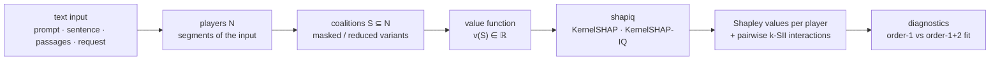

# shapiq-text-llm-explanations

Explaining large language models with **Shapley values and Shapley interactions**, built on
[`shapiq`](https://github.com/mmschlk/shapiq). Developed as an LMU Munich practical-course project.

The common idea across the project: turn one concrete LLM behavior into a **cooperative game**
`v : 2^N → ℝ` — pick the *players* (sentences, words, passages, request segments), define a
*value function* that scores any subset of them, and let shapiq attribute the behavior to players
(Shapley values) and player *pairs* (second-order k-SII interactions). Each demo instantiates this
recipe for a different task. Several demos also report task-specific diagnostics—such as
reconstruction gains or deletion curves—to show when an additive, first-order explanation misses
important structure.



## The four demos

| Demo | Question it answers | Run |
|---|---|---|
| [Jailbreak Analysis](src/demos/JailbreakAnalysis/) | Which prompt sentences — and sentence *pairs* — make an LLM comply with a jailbreak? | `uv run streamlit run src/demos/JailbreakAnalysis/results_app.py` |
| [Sentiment Analysis](src/demos/SentimentAnalysis/) | Which words and word pairs carry a sentence's sentiment ("not bad" ≠ "not" + "bad")? | `uv run streamlit run src/demos/SentimentAnalysis/results_app.py` |
| [Agentic Tool Use](src/demos/agentic_tool_use_explanation/) | Which parts of a user request drive an agent's tool selection? | `uv run streamlit run src/demos/agentic_tool_use_explanation/app.py` |
| [RAG Retrieval](demos/rag_retrieval_explanation/) | Which retrieved passages support a RAG answer — and which are redundant or conflicting? | `make app` (see below) |

## Setup

Requires Python ≥ 3.12 and [uv](https://docs.astral.sh/uv/).

```bash
git clone https://github.com/Arian-Vaezi/shapiq-text-llm-explanations
cd shapiq-text-llm-explanations
uv sync                          # all demos except RAG
uv sync --group rag_demo         # additionally, for the RAG demo
```

The precomputed Jailbreak and Sentiment results dashboards run **offline from committed result
files** — no GPU, API key, or model download. The *live* apps load Hugging Face models locally and
can optionally use API models. Set `GROQ_API_KEY` or `GEMINI_API_KEY` for API backends and
expose `HF_TOKEN` in the environment (or authenticate with Hugging Face) for gated models such as
Llama‑3.x and Gemma. The API wrappers load a local `.env`; the provided vulnerability-scan Slurm
script can also source `.env`, while direct scan CLI runs read the process environment.

---

### 1 · Jailbreak Analysis

The reported experiments use the **sentences of an adversarial prompt** as players; a coalition is
the prompt with only those sentences kept. They compare two value-function designs:

- **Logprob contrast** — `mean log P(comply-style continuation) − mean log P(refusal-style)`,
  baseline-centered so `v(∅) = 0`. Deterministic and interaction-rich, with no response
  generation — but still a *proxy* for compliance.
- **LLM-as-a-judge pilot** — generate a response and grade it 0–10. This is a more direct
  behavioral proxy, but it was near-binary in the seven committed pilot runs, so pairwise
  interactions were small. The trade-off between the two is a central finding.

Reported results: a **5 models × 6 temperatures × 15 prompts** vulnerability scan (binary
`gpt-oss-safeguard-20b` judge; 450 configurations, 449 parseable verdicts, 178 jailbroken) and a
**30-run second-order k-SII sweep** with an order-1 vs order-1+2 reconstruction diagnostic
(ΔR² up to +60 pp).


```bash
# Offline results explorer (scan results + per-prompt Shapley/k-SII/reconstruction):
uv run streamlit run src/demos/JailbreakAnalysis/results_app.py

# Live app (local HF models; optional API models via GROQ_API_KEY / GEMINI_API_KEY):
uv run streamlit run src/demos/JailbreakAnalysis/app.py

# Inspect the vulnerability-scan grid (GPU required only for actual runs):
uv run python run_vulnerability_scan.py --list-grid
```

### 2 · Sentiment Analysis

Two `shapiq.Game`s feed the same KernelSHAP / KernelSHAP-IQ engine:
an **encoder** game (`[MASK]` imputation, `v(S) = P(pos) − P(neg)`) and a **decoder** game
(word removal, contrastive log-odds over language-matched templates). Includes multilingual
experiments (exact and approximate) run on Slurm.

```bash
uv run streamlit run src/demos/SentimentAnalysis/results_app.py   # precomputed dashboard
uv run streamlit run src/demos/SentimentAnalysis/app.py           # live app
```

### 3 · Agentic Tool-Use Explanation

A full-context agent run (native Hugging Face tool-calling) fixes the explanation target — the
selected tool (`weather_tool`, `calculator_tool`, `web_search_tool`, or a direct answer). The user
request is segmented (embedding- or spaCy-based), and coalition scoring shows which segments
support or oppose that frozen target. Post-hoc by design: it characterizes observable behavior
under masking, not the model's internal routing.

```bash
uv run streamlit run src/demos/agentic_tool_use_explanation/app.py
```

### 4 · RAG Retrieval Explanation

Which retrieved passages does the generated answer actually rest on? Players are the retrieved
passages; generation runs locally via llama.cpp (GGUF models, downloadable via
`uv run python scripts/download_models.py --list`). Ships as a FastAPI + React app with a
labelled controlled benchmark (complementary / redundant / conflicting evidence pairs), a QASPER
subset, and a prior-knowledge control.

The main research output is the static
[`eval_report.html`](demos/rag_retrieval_explanation/eval_report.html) — open or rebuild it with
**no model inference**:

```bash
uv sync --group rag_demo
npm --prefix demos/rag_retrieval_explanation/frontend install
make app                     # serve at http://127.0.0.1:8000
make verify-report-results   # recompute reported metrics from versioned artifacts
```

---

## Repository layout

```text
src/shapiq/                      the shapiq library (fork; text imputers + plot utilities added)
src/demos/JailbreakAnalysis/     jailbreak demo: apps, game, k-SII runner, committed result summaries
src/demos/SentimentAnalysis/     sentiment demo: encoder/decoder games, apps, experiment runners
src/demos/agentic_tool_use_explanation/   tool-use demo (Streamlit)
src/demos/shared/                shared model wrappers (causal / encoder / API / embedding)
demos/rag_retrieval_explanation/ RAG demo (FastAPI backend, React frontend, eval suite)
run_vulnerability_scan.py        jailbreak vulnerability scan (with Slurm scripts *.sbatch)
tests/                           library + demo tests
```

## Tests and code quality

```bash
uv run pytest tests/shapiq            # library tests
uv run pre-commit run --all-files     # file checks, Ruff lint/format, and ty
```

## Notes for reviewers

- The Jailbreak and Sentiment results dashboards, plus the static RAG evaluation report, use
  versioned result data. Live apps may require local models or API access. Selected raw runs and
  derived summaries are committed; model weights and some larger experiment directories are not.
- GPU experiments were run on an A100 (LRZ) via the provided `*.sbatch` scripts. `pyproject.toml`
  selects platform-specific PyTorch indexes, and `uv.lock` locks the resolved dependency versions.
- Hugging Face model IDs are recorded, but the current loaders do not pin model revisions. Exact
  reruns may therefore drift if an upstream model repository changes.
- Before submitting a root or RAG `*.sbatch` job that writes to `logs/`, create that directory
  from the repository root with `mkdir -p logs`; Slurm opens output files before the job starts.
- This repository is a fork of [mmschlk/shapiq](https://github.com/mmschlk/shapiq); the library
  parts remain under the upstream MIT license.
