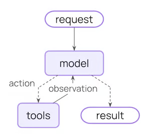
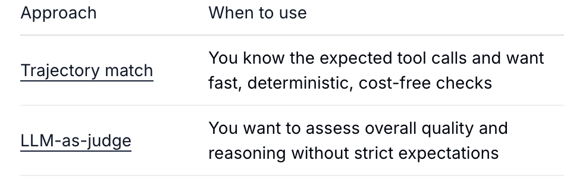

# Langchain Agent (internal)
Reference: (https://docs.langchain.com/oss/python/langchain/agents)

## Minimal pipeline

- Access Model Tokens(Groq)
- create agent with LLM, tools (mocked right now), system prompt
- Agent runs(invocation) or streams the textual response.

## Visualize LLM reasoning steps
It might be interesting to see how the LLM makes the decision: whether to call a tool, what tool to call? which params to pass? etc.
Two possible ways of visualization
- Custom Middleware that logs it. Reference: https://docs.langchain.com/oss/python/langchain/middleware/overview
- via `print(response["messages"][-1].additional_kwargs.get("reasoning_content"))`. Note: not all LLMs have (expose) this.

## Agent Evaluation.
Did agent behave as expected? (i.e. Did it call the right tool? Did it pass the right params? ...)

Langchain provides a built-in evaluator library `agentevals`. This could be a way to implement our value function. Checkout https://docs.langchain.com/oss/python/langchain/test/evals

- Trajectory matching:

Does the agent produce the same trajectory as the baseline? Modes: Strict, unordered, subset, superset
A trajectory is a sequence of AI/HumanMessages.

- LLM-as-Judge

Uses a second LLM call to qualitatively assess whether the reasoning trajectory was accurate and efficient. Returns a `score` + a natural-language `comment` explaining the verdict.

### 4 · some interesting Middleware
Reference: https://docs.langchain.com/oss/python/langchain/middleware/built-in

Middlewares serve as optional intermediate function calls in the outgoiing edges, such as between (userrequest, model), (model,tool), (model, result).
Candidates worth exploring for the demo:
- human in the loop
- model/tool call limit
- file search
- subagent
- custom
