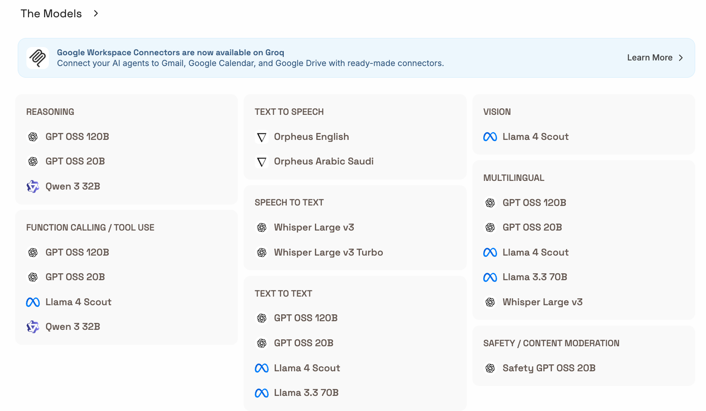

# Groq vs Google AI Studio (2026)

---

## 🟠 Groq

**What it is:** Cloud inference provider running open-source models on proprietary LPU (Language Processing Unit) chips. Focused on **ultra-low latency** (500–3000+ tokens/second). OpenAI SDK-compatible (drop-in `base_url` swap).

**Sign up:** [console.groq.com](https://console.groq.com) — no credit card required.

### Free Tier Limits (org-level)
| Constraint             | Limit            |
| ---------------------- | ---------------- |
| Requests / min (RPM)   | 30 (most models) |
| Tokens / min (TPM)     | 6,000            |
| Requests / day (RPD)   | 1,000            |
| Credit card required   | ❌ No             |
| Data used for training | ❌ No             |

### Supported Models (Free Tier) From (https://console.groq.com/home)

- For the specific model_id: visit the website, click on the model. The model_id is shown in the playground.

- Groq hosts **only open-source models** — no GPT, Claude, or Gemini.

---

## 🔵 Google AI Studio / Gemini API

**What it is:** Google's developer gateway to Gemini models. The browser UI is always free; the underlying API has a free tier (rate-limited). Uses the `google-genai` Python SDK.

**Sign up:** [aistudio.google.com](https://aistudio.google.com) — Google account only, no credit card.

### Free Tier Limits (as of April 2026)
| Model                 | RPM | RPD   | TPM       |
| --------------------- | --- | ----- | --------- |
| Gemini 2.5 Flash      | 10  | 500   | 250,000   |
| Gemini 2.5 Flash-Lite | 15  | 1,500 | 1,000,000 |
| Gemini 2.5 Pro        | ~2  | 50    | limited   |

> ⚠️ **April 2026 change:** Pro models removed from free tier for API; only Flash + Flash-Lite retain generous free quotas. Free tier data **may be used for model training** by Google. Enable billing to opt out.

### Supported Models (Selected)

| Model                   | Context   | Highlights                                  |
| ----------------------- | --------- | ------------------------------------------- |
| `gemini-2.5-flash`      | 1M tokens | Best free-tier workhorse; fast + capable    |
| `gemini-2.5-flash-lite` | 1M tokens | Cheaper; good for classification/routing    |
| `gemini-2.5-pro`        | 1M tokens | Strongest; 50 RPD free, paid for production |
| `gemini-2.0-flash`      | 1M tokens | Deprecated June 1 2026 → migrate to 2.5     |
| `gemini-1.5-pro`        | 2M tokens | Legacy long-context model                   |
| `imagen-3`              | —         | Text-to-image (paid only)                   |

> Gemini models support **text, images, audio, video, and documents** natively.

---

## Quick Comparison

|                  | Groq                            | Google AI Studio                 |
| ---------------- | ------------------------------- | -------------------------------- |
| **Speed**        | ⚡ 500–3000 tok/s                | ~100–300 tok/s                   |
| **Free RPD**     | 1,000                           | 500–1,500                        |
| **Free TPM**     | 6,000                           | 250K–1M                          |
| **Models**       | Open-source only                | Gemini family (proprietary)      |
| **Multimodal**   | Vision via Llama 4              | Full (text/img/audio/video)      |
| **Context**      | Up to 128K                      | Up to 2M tokens                  |
| **Data privacy** | ✅ Not used for training         | ⚠️ Used for training (free tier)  |
| **SDK compat**   | OpenAI SDK (drop-in)            | `google-genai` SDK               |
| **Best for**     | Latency-critical, agentic loops | Long-context, multimodal, volume |
